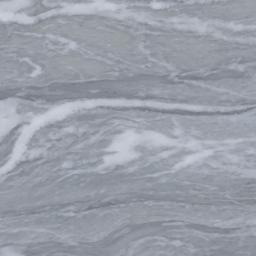
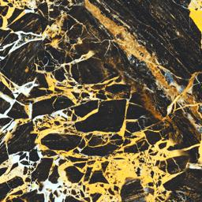

# [DDPM for tile texture generation](https://github.com/DobyChao/ddpm-for-tile-texture-generation)
A tile texture generater using Denoising Diffusion Probabilistic Models (DDPM) with Classifier-free Guidance and DDIM sampling.

 

## Requirements
```
pip install -r requirements.txt
```
If you have trouble installing PyYAML, try
```
pip install --ignore-installed PyYAML
```
## Dataset Structure
The project uses following folder structure for dataset.
```
dataset/
└── images/
    ├── 00/
    │   ├── 00.jpg
    │   ├── ...
    ├── 01/
    │   ├── ...
    ├── ...
```
## Train
Make sure that the configuration files in `config/` meet your needs, or create a new one instead.

View `config/template.yaml` for more information.
```
config/
├── template.yaml
├── config_64.yaml
├── config_128.yaml
└── [your new configuration file here]
```
Then run
```
python train.py --config [your config]
```
If you want to resume training, add `--load_latest`
For example, to resume training a 64*64 model
```
python train.py --config config/config_64.yaml --load_latest
```
## Sampling
```
python sample.py --model_path [your model path]
```
You can optionally add the following command parameters
- `--steps [steps]`: sampling steps. Less is faster
- `--eta [eta]` : eta, 0.0 for deterministic sampler
- `--batches [batches]`: The number of batches to sample
- `--w [w]`: guided w mention in [Classifier-free Diffusion Guidance](https://arxiv.org/abs/2207.12598)
- `--mode [DDPM/DDIM]`: To choose which sampler to use

To control the categories of generated images, change object `y` in `sample.py` yourself.

For instance, set `y` to `[0, 2, 5, 30]` means generate four pictures per batch, and the categories are 0, 2, 5 and 30.

## Demo
A demo built with Flask. Install Flask first.
```
pip install Flask
```
Then run
```
python app.py
```
and access `127.0.0.1/Image_Generate`.

We have released models [here](https://1drv.ms/u/s!Au9Bc8R_q-CDhT0uayEk2bkuN0dU?e=brs9ch) used for demo.
## Acknowledgement
The codes are heavily based on https://github.com/FutureXiang/Diffusion. The model parameters are set with reference to [Beat GANs](https://arxiv.org/abs/2105.05233).